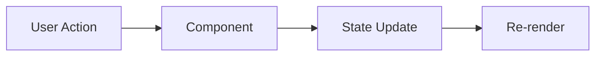

# Implementation Plan: [Feature Name]

## Overview

**Spec Reference:** [Link to spec file]
**Target Completion:** [Date]
**Assignee:** [Name/AI Agent]

---

## Summary

Brief description of what will be implemented and the approach.

---

## Prerequisites

Before starting implementation:

- [ ] Prerequisite 1
- [ ] Prerequisite 2
- [ ] Dependencies installed

---

## Implementation Phases

### Phase 1: [Phase Name]

**Objective:** What this phase accomplishes

**Tasks:**

1. [ ] Task 1
   - File: `path/to/file.tsx`
   - Details: What to do
   
2. [ ] Task 2
   - File: `path/to/file.tsx`
   - Details: What to do

**Deliverables:**
- Deliverable 1
- Deliverable 2

---

### Phase 2: [Phase Name]

**Objective:** What this phase accomplishes

**Tasks:**

1. [ ] Task 1
2. [ ] Task 2

**Deliverables:**
- Deliverable 1

---

## File Changes

| File | Action | Description |
|------|--------|-------------|
| `path/to/file.tsx` | Create/Update/Delete | Brief description |
| `path/to/file.tsx` | Create/Update/Delete | Brief description |

---

## Component Architecture

```
ComponentName/
├── ComponentName.tsx      # Main component
├── ComponentName.types.ts # TypeScript types
└── index.ts               # Export
```

---

## Data Flow



---

## Testing Checklist

### Functional Testing

- [ ] Feature works as specified
- [ ] Edge cases handled
- [ ] Error states display correctly

### Visual Testing

- [ ] Desktop layout correct
- [ ] Tablet layout correct
- [ ] Mobile layout correct
- [ ] Animations work

### Accessibility Testing

- [ ] Keyboard navigation works
- [ ] Screen reader compatible
- [ ] Focus states visible

### Performance Testing

- [ ] No console errors
- [ ] No CLS issues
- [ ] Load time acceptable

---

## Rollback Plan

If issues arise, how to revert:

1. Step 1
2. Step 2

---

## Notes

Additional context or decisions made during planning.

---

## Approval

- [ ] Plan reviewed
- [ ] Ready for implementation


